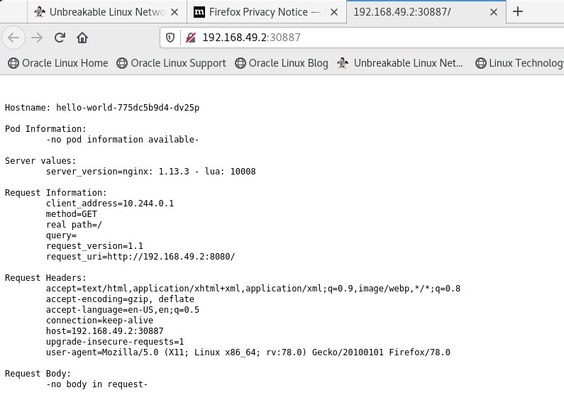

### K8 installation

Here we will do a Single Node Deplyment (MiniKube K8s Cluster) and in later we will do HA deployments.

Uninstall any prior old versions:
```
[root@k8-node1 ~]# rpm -e docker docker-engine docker.io containerd runc
error: package docker is not installed
error: package docker-engine is not installed
error: package docker.io is not installed
error: package containerd is not installed
[root@k8-node1 ~]# 
[root@k8-node1 ~]# rpm -e runc podman cockpit-podman buildah podman-catatonit 
/sbin/ldconfig: /etc/ld.so.conf.d/kernel-5.4.17-2102.201.3.el8uek.x86_64.conf:6: hwcap directive ignored
[root@k8-node1 ~]# 
[root@k8-node1 ~]# dnf -y install dnf-plugins-core
Last metadata expiration check: 0:12:02 ago on Sat 16 Nov 2024 09:42:06 PM EST.
Package dnf-plugins-core-4.0.18-4.el8.noarch is already installed.
Dependencies resolved.
================================================================================================================================================
 Package                                  Architecture           Version                                Repository                         Size
================================================================================================================================================
Upgrading:
 dnf                                      noarch                 4.7.0-20.0.1.el8                       ol8_baseos_latest                 542 k
 dnf-data                                 noarch                 4.7.0-20.0.1.el8                       ol8_baseos_latest                 156 k
 dnf-plugins-core                         noarch                 4.0.21-25.0.1.el8                      ol8_baseos_latest                  76 k
 json-c                                   x86_64                 0.13.1-3.el8                           ol8_baseos_latest                  41 k
 libdnf                                   x86_64                 0.63.0-20.0.1.el8_10                   ol8_baseos_latest                 711 k
 libmodulemd                              x86_64                 2.13.0-1.el8                           ol8_baseos_latest                 233 k
 librepo                                  x86_64                 1.14.2-5.el8                           ol8_baseos_latest                  92 k
 libsolv                                  x86_64                 0.7.20-6.el8                           ol8_baseos_latest                 376 k
 python3-dnf                              noarch                 4.7.0-20.0.1.el8                       ol8_baseos_latest                 549 k
 python3-dnf-plugins-core                 noarch                 4.0.21-25.0.1.el8                      ol8_baseos_latest                 263 k
 python3-hawkey                           x86_64                 0.63.0-20.0.1.el8_10                   ol8_baseos_latest                 118 k
 python3-libdnf                           x86_64                 0.63.0-20.0.1.el8_10                   ol8_baseos_latest                 780 k
 python3-librepo                          x86_64                 1.14.2-5.el8                           ol8_baseos_latest                  53 k
 yum                                      noarch                 4.7.0-20.0.1.el8                       ol8_baseos_latest                 208 k

Transaction Summary
================================================================================================================================================
Upgrade  14 Packages

Total download size: 4.1 M
Downloading Packages:
(1/14): dnf-plugins-core-4.0.21-25.0.1.el8.noarch.rpm                                                           327 kB/s |  76 kB     00:00    
(2/14): json-c-0.13.1-3.el8.x86_64.rpm                                                                          1.0 MB/s |  41 kB     00:00    
(3/14): dnf-data-4.7.0-20.0.1.el8.noarch.rpm                                                                    574 kB/s | 156 kB     00:00     
(4/14): dnf-4.7.0-20.0.1.el8.noarch.rpm                                                                         1.7 MB/s | 542 kB     00:00     
(5/14): libmodulemd-2.13.0-1.el8.x86_64.rpm                                                                     3.0 MB/s | 233 kB     00:00     
(6/14): librepo-1.14.2-5.el8.x86_64.rpm                                                                         3.0 MB/s |  92 kB     00:00     
(7/14): libdnf-0.63.0-20.0.1.el8_10.x86_64.rpm                                                                  5.9 MB/s | 711 kB     00:00     
(8/14): python3-dnf-4.7.0-20.0.1.el8.noarch.rpm                                                                 7.9 MB/s | 549 kB     00:00     
(9/14): libsolv-0.7.20-6.el8.x86_64.rpm                                                                         4.6 MB/s | 376 kB     00:00     
(10/14): python3-dnf-plugins-core-4.0.21-25.0.1.el8.noarch.rpm                                                  6.5 MB/s | 263 kB     00:00     
(11/14): python3-hawkey-0.63.0-20.0.1.el8_10.x86_64.rpm                                                         3.8 MB/s | 118 kB     00:00     
(12/14): python3-librepo-1.14.2-5.el8.x86_64.rpm                                                                1.5 MB/s |  53 kB     00:00     
(13/14): yum-4.7.0-20.0.1.el8.noarch.rpm                                                                        5.7 MB/s | 208 kB     00:00     
(14/14): python3-libdnf-0.63.0-20.0.1.el8_10.x86_64.rpm                                                          10 MB/s | 780 kB     00:00     
------------------------------------------------------------------------------------------------------------------------------------------------
Total                                                                                                           8.0 MB/s | 4.1 MB     00:00     
Running transaction check
Transaction check succeeded.
Running transaction test
Transaction test succeeded.
Running transaction
  Preparing        :                                                                                                                        1/1 
  Running scriptlet: librepo-1.14.2-5.el8.x86_64                                                                                            1/1 
  Upgrading        : librepo-1.14.2-5.el8.x86_64                                                                                           1/28 
  Upgrading        : libmodulemd-2.13.0-1.el8.x86_64                                                                                       2/28 
  Upgrading        : libsolv-0.7.20-6.el8.x86_64                                                                                           3/28 
  Upgrading        : json-c-0.13.1-3.el8.x86_64                                                                                            4/28 
  Upgrading        : libdnf-0.63.0-20.0.1.el8_10.x86_64                                                                                    5/28 
  Upgrading        : python3-libdnf-0.63.0-20.0.1.el8_10.x86_64                                                                            6/28 
  Upgrading        : python3-hawkey-0.63.0-20.0.1.el8_10.x86_64                                                                            7/28 
  Upgrading        : dnf-data-4.7.0-20.0.1.el8.noarch                                                                                      8/28 
  Upgrading        : python3-dnf-4.7.0-20.0.1.el8.noarch                                                                                   9/28 
  Upgrading        : dnf-4.7.0-20.0.1.el8.noarch                                                                                          10/28 
  Running scriptlet: dnf-4.7.0-20.0.1.el8.noarch                                                                                          10/28 
  Upgrading        : python3-dnf-plugins-core-4.0.21-25.0.1.el8.noarch                                                                    11/28 
  Upgrading        : dnf-plugins-core-4.0.21-25.0.1.el8.noarch                                                                            12/28 
  Upgrading        : yum-4.7.0-20.0.1.el8.noarch                                                                                          13/28 
  Upgrading        : python3-librepo-1.14.2-5.el8.x86_64                                                                                  14/28 
  Cleanup          : yum-4.4.2-11.el8.noarch                                                                                              15/28 
  Running scriptlet: dnf-4.4.2-11.el8.noarch                                                                                              16/28 
  Cleanup          : dnf-4.4.2-11.el8.noarch                                                                                              16/28 
  Running scriptlet: dnf-4.4.2-11.el8.noarch                                                                                              16/28 
  Cleanup          : dnf-plugins-core-4.0.18-4.el8.noarch                                                                                 17/28 
  Cleanup          : python3-dnf-plugins-core-4.0.18-4.el8.noarch                                                                         18/28 
  Cleanup          : python3-dnf-4.4.2-11.el8.noarch                                                                                      19/28 
  Cleanup          : python3-hawkey-0.55.0-7.0.1.el8.x86_64                                                                               20/28 
  Cleanup          : python3-libdnf-0.55.0-7.0.1.el8.x86_64                                                                               21/28 
  Cleanup          : libdnf-0.55.0-7.0.1.el8.x86_64                                                                                       22/28 
  Cleanup          : python3-librepo-1.12.0-3.el8.x86_64                                                                                  23/28 
  Cleanup          : dnf-data-4.4.2-11.el8.noarch                                                                                         24/28 
  Cleanup          : librepo-1.12.0-3.el8.x86_64                                                                                          25/28 
  Cleanup          : json-c-0.13.1-0.4.el8.x86_64                                                                                         26/28 
  Cleanup          : libmodulemd-2.9.4-2.el8.x86_64                                                                                       27/28 
  Cleanup          : libsolv-0.7.16-2.el8.x86_64                                                                                          28/28 
  Running scriptlet: libsolv-0.7.16-2.el8.x86_64                                                                                          28/28 
/sbin/ldconfig: /etc/ld.so.conf.d/kernel-5.4.17-2102.201.3.el8uek.x86_64.conf:6: hwcap directive ignored

/sbin/ldconfig: /etc/ld.so.conf.d/kernel-5.4.17-2102.201.3.el8uek.x86_64.conf:6: hwcap directive ignored

  Verifying        : dnf-4.7.0-20.0.1.el8.noarch                                                                                           1/28 
  Verifying        : dnf-4.4.2-11.el8.noarch                                                                                               2/28 
  Verifying        : dnf-data-4.7.0-20.0.1.el8.noarch                                                                                      3/28 
  Verifying        : dnf-data-4.4.2-11.el8.noarch                                                                                          4/28 
  Verifying        : dnf-plugins-core-4.0.21-25.0.1.el8.noarch                                                                             5/28 
  Verifying        : dnf-plugins-core-4.0.18-4.el8.noarch                                                                                  6/28 
  Verifying        : json-c-0.13.1-3.el8.x86_64                                                                                            7/28 
  Verifying        : json-c-0.13.1-0.4.el8.x86_64                                                                                          8/28 
  Verifying        : libdnf-0.63.0-20.0.1.el8_10.x86_64                                                                                    9/28 
  Verifying        : libdnf-0.55.0-7.0.1.el8.x86_64                                                                                       10/28 
  Verifying        : libmodulemd-2.13.0-1.el8.x86_64                                                                                      11/28 
  Verifying        : libmodulemd-2.9.4-2.el8.x86_64                                                                                       12/28 
  Verifying        : librepo-1.14.2-5.el8.x86_64                                                                                          13/28 
  Verifying        : librepo-1.12.0-3.el8.x86_64                                                                                          14/28 
  Verifying        : libsolv-0.7.20-6.el8.x86_64                                                                                          15/28 
  Verifying        : libsolv-0.7.16-2.el8.x86_64                                                                                          16/28 
  Verifying        : python3-dnf-4.7.0-20.0.1.el8.noarch                                                                                  17/28 
  Verifying        : python3-dnf-4.4.2-11.el8.noarch                                                                                      18/28 
  Verifying        : python3-dnf-plugins-core-4.0.21-25.0.1.el8.noarch                                                                    19/28 
  Verifying        : python3-dnf-plugins-core-4.0.18-4.el8.noarch                                                                         20/28 
  Verifying        : python3-hawkey-0.63.0-20.0.1.el8_10.x86_64                                                                           21/28 
  Verifying        : python3-hawkey-0.55.0-7.0.1.el8.x86_64                                                                               22/28 
  Verifying        : python3-libdnf-0.63.0-20.0.1.el8_10.x86_64                                                                           23/28 
  Verifying        : python3-libdnf-0.55.0-7.0.1.el8.x86_64                                                                               24/28 
  Verifying        : python3-librepo-1.14.2-5.el8.x86_64                                                                                  25/28 
  Verifying        : python3-librepo-1.12.0-3.el8.x86_64                                                                                  26/28 
  Verifying        : yum-4.7.0-20.0.1.el8.noarch                                                                                          27/28 
  Verifying        : yum-4.4.2-11.el8.noarch                                                                                              28/28 

Upgraded:
  dnf-4.7.0-20.0.1.el8.noarch                         dnf-data-4.7.0-20.0.1.el8.noarch             dnf-plugins-core-4.0.21-25.0.1.el8.noarch    
  json-c-0.13.1-3.el8.x86_64                          libdnf-0.63.0-20.0.1.el8_10.x86_64           libmodulemd-2.13.0-1.el8.x86_64
  librepo-1.14.2-5.el8.x86_64                         libsolv-0.7.20-6.el8.x86_64                  python3-dnf-4.7.0-20.0.1.el8.noarch
  python3-dnf-plugins-core-4.0.21-25.0.1.el8.noarch   python3-hawkey-0.63.0-20.0.1.el8_10.x86_64   python3-libdnf-0.63.0-20.0.1.el8_10.x86_64   
  python3-librepo-1.14.2-5.el8.x86_64                 yum-4.7.0-20.0.1.el8.noarch

Complete!
[root@k8-node1 ~]# 
[root@k8-node1 ~]# dnf config-manager --add-repo https://download.docker.com/linux/rhel/docker-ce.repo
Adding repo from: https://download.docker.com/linux/rhel/docker-ce.repo
[root@k8-node1 ~]# 
[root@k8-node1 ~]# dnf install docker-ce docker-ce-cli containerd.io docker-buildx-plugin docker-compose-plugin
Last metadata expiration check: 0:03:27 ago on Sat 16 Nov 2024 09:55:32 PM EST.
Dependencies resolved.
================================================================================================================================================
 Package                                    Architecture            Version                            Repository                          Size 
================================================================================================================================================
Installing:
 containerd.io                              x86_64                  1.7.23-3.1.el8                     docker-ce-stable                    45 M 
 docker-buildx-plugin                       x86_64                  0.17.1-1.el8                       docker-ce-stable                    14 M 
 docker-ce                                  x86_64                  3:27.3.1-1.el8                     docker-ce-stable                    28 M 
 docker-ce-cli                              x86_64                  1:27.3.1-1.el8                     docker-ce-stable                   8.0 M 
 docker-compose-plugin                      x86_64                  2.29.7-1.el8                       docker-ce-stable                    14 M 
Installing dependencies:
 libcgroup                                  x86_64                  0.41-19.el8                        ol8_baseos_latest                   70 k 
Installing weak dependencies:
 docker-ce-rootless-extras                  x86_64                  27.3.1-1.el8                       docker-ce-stable                   5.1 M 

Transaction Summary
================================================================================================================================================
Install  7 Packages

Total download size: 113 M
Installed size: 426 M
Is this ok [y/N]: y
Downloading Packages:
(1/7): docker-buildx-plugin-0.17.1-1.el8.x86_64.rpm                                                              14 MB/s |  14 MB     00:00     
(2/7): docker-ce-cli-27.3.1-1.el8.x86_64.rpm                                                                     23 MB/s | 8.0 MB     00:00     
(3/7): docker-ce-rootless-extras-27.3.1-1.el8.x86_64.rpm                                                         22 MB/s | 5.1 MB     00:00     
(4/7): containerd.io-1.7.23-3.1.el8.x86_64.rpm                                                                   25 MB/s |  45 MB     00:01     
(5/7): libcgroup-0.41-19.el8.x86_64.rpm                                                                         334 kB/s |  70 kB     00:00     
(6/7): docker-ce-27.3.1-1.el8.x86_64.rpm                                                                         13 MB/s |  28 MB     00:02     
(7/7): docker-compose-plugin-2.29.7-1.el8.x86_64.rpm                                                             16 MB/s |  14 MB     00:00     
------------------------------------------------------------------------------------------------------------------------------------------------
Total                                                                                                            47 MB/s | 113 MB     00:02     
Docker CE Stable - x86_64                                                                                        18 kB/s | 1.6 kB     00:00    
Importing GPG key 0x621E9F35:
 Userid     : "Docker Release (CE rpm) <docker@docker.com>"
 Fingerprint: 060A 61C5 1B55 8A7F 742B 77AA C52F EB6B 621E 9F35
 From       : https://download.docker.com/linux/rhel/gpg
Is this ok [y/N]: y
Key imported successfully
Running transaction check
Transaction check succeeded.
Running transaction test
Transaction test succeeded.
Running transaction
  Preparing        :                                                                                                                        1/1 
  Installing       : docker-compose-plugin-2.29.7-1.el8.x86_64                                                                              1/7 
  Running scriptlet: docker-compose-plugin-2.29.7-1.el8.x86_64                                                                              1/7 
  Running scriptlet: libcgroup-0.41-19.el8.x86_64                                                                                           2/7 
  Installing       : libcgroup-0.41-19.el8.x86_64                                                                                           2/7 
  Running scriptlet: libcgroup-0.41-19.el8.x86_64                                                                                           2/7 
/sbin/ldconfig: /etc/ld.so.conf.d/kernel-5.4.17-2102.201.3.el8uek.x86_64.conf:6: hwcap directive ignored

  Installing       : docker-buildx-plugin-0.17.1-1.el8.x86_64                                                                               3/7 
  Running scriptlet: docker-buildx-plugin-0.17.1-1.el8.x86_64                                                                               3/7 
  Installing       : docker-ce-cli-1:27.3.1-1.el8.x86_64                                                                                    4/7 
  Running scriptlet: docker-ce-cli-1:27.3.1-1.el8.x86_64                                                                                    4/7 
  Installing       : containerd.io-1.7.23-3.1.el8.x86_64                                                                                    5/7 
  Running scriptlet: containerd.io-1.7.23-3.1.el8.x86_64                                                                                    5/7 
  Installing       : docker-ce-rootless-extras-27.3.1-1.el8.x86_64                                                                          6/7 
  Running scriptlet: docker-ce-rootless-extras-27.3.1-1.el8.x86_64                                                                          6/7 
  Installing       : docker-ce-3:27.3.1-1.el8.x86_64                                                                                        7/7 
  Running scriptlet: docker-ce-3:27.3.1-1.el8.x86_64                                                                                        7/7 
/sbin/ldconfig: /etc/ld.so.conf.d/kernel-5.4.17-2102.201.3.el8uek.x86_64.conf:6: hwcap directive ignored

  Verifying        : containerd.io-1.7.23-3.1.el8.x86_64                                                                                    1/7 
  Verifying        : docker-buildx-plugin-0.17.1-1.el8.x86_64                                                                               2/7 
  Verifying        : docker-ce-3:27.3.1-1.el8.x86_64                                                                                        3/7 
  Verifying        : docker-ce-cli-1:27.3.1-1.el8.x86_64                                                                                    4/7 
  Verifying        : docker-ce-rootless-extras-27.3.1-1.el8.x86_64                                                                          5/7 
  Verifying        : docker-compose-plugin-2.29.7-1.el8.x86_64                                                                              6/7 
  Verifying        : libcgroup-0.41-19.el8.x86_64                                                                                           7/7 

Installed:
  containerd.io-1.7.23-3.1.el8.x86_64       docker-buildx-plugin-0.17.1-1.el8.x86_64            docker-ce-3:27.3.1-1.el8.x86_64
  docker-ce-cli-1:27.3.1-1.el8.x86_64       docker-ce-rootless-extras-27.3.1-1.el8.x86_64       docker-compose-plugin-2.29.7-1.el8.x86_64       
  libcgroup-0.41-19.el8.x86_64

Complete!
[root@k8-node1 ~]# 
```

Now lets check docker version and start the services:
```
[root@k8-node1 ~]# docker --version
Docker version 27.3.1, build ce12230
[root@k8-node1 ~]# systemctl enable docker
Created symlink /etc/systemd/system/multi-user.target.wants/docker.service → /usr/lib/systemd/system/docker.service.
[root@k8-node1 ~]# 
[root@k8-node1 ~]# systemctl enable docker
Created symlink /etc/systemd/system/multi-user.target.wants/docker.service → /usr/lib/systemd/system/docker.service.
[root@k8-node1 ~]# systemctl start docker
[root@k8-node1 ~]# systemctl status docker
● docker.service - Docker Application Container Engine
   Loaded: loaded (/usr/lib/systemd/system/docker.service; enabled; vendor preset: disabled)
   Active: active (running) since Sat 2024-11-16 22:28:56 EST; 5s ago
     Docs: https://docs.docker.com
 Main PID: 47524 (dockerd)
    Tasks: 8
   Memory: 20.7M
   CGroup: /system.slice/docker.service
           └─47524 /usr/bin/dockerd -H fd:// --containerd=/run/containerd/containerd.sock

Nov 16 22:28:55 k8-node1.localdomain dockerd[47524]: time="2024-11-16T22:28:55.195396987-05:00" level=info msg="Loading containers: start."     
Nov 16 22:28:56 k8-node1.localdomain dockerd[47524]: time="2024-11-16T22:28:56.391139518-05:00" level=info msg="Firewalld: interface docker0 al>
Nov 16 22:28:56 k8-node1.localdomain dockerd[47524]: time="2024-11-16T22:28:56.615002234-05:00" level=info msg="Loading containers: done."      
Nov 16 22:28:56 k8-node1.localdomain dockerd[47524]: time="2024-11-16T22:28:56.627408351-05:00" level=warning msg="Not using native diff for ov>
Nov 16 22:28:56 k8-node1.localdomain dockerd[47524]: time="2024-11-16T22:28:56.627517071-05:00" level=warning msg="WARNING: bridge-nf-call-ipta>
Nov 16 22:28:56 k8-node1.localdomain dockerd[47524]: time="2024-11-16T22:28:56.627528372-05:00" level=warning msg="WARNING: bridge-nf-call-ip6t>
Nov 16 22:28:56 k8-node1.localdomain dockerd[47524]: time="2024-11-16T22:28:56.627543124-05:00" level=info msg="Docker daemon" commit=41ca978 c>
Nov 16 22:28:56 k8-node1.localdomain dockerd[47524]: time="2024-11-16T22:28:56.627806547-05:00" level=info msg="Daemon has completed initializa>
Nov 16 22:28:56 k8-node1.localdomain dockerd[47524]: time="2024-11-16T22:28:56.665464262-05:00" level=info msg="API listen on /run/docker.sock" 
Nov 16 22:28:56 k8-node1.localdomain systemd[1]: Started Docker Application Container Engine.
[root@k8-node1 ~]#
```

Now we will setup KubeCtl, and this can be done in two ways one by downloading the binaries other is by using package manager, here we will do both

Using package manager:

Create repo and install 
```
[root@k8-node1 ~]# cat <<EOF | sudo tee /etc/yum.repos.d/kubernetes.repo
> [kubernetes]
> name=Kubernetes
> baseurl=https://pkgs.k8s.io/core:/stable:/v1.31/rpm/
> enabled=1
> gpgcheck=1
> gpgkey=https://pkgs.k8s.io/core:/stable:/v1.31/rpm/repodata/repomd.xml.key
> EOF
[kubernetes]
name=Kubernetes
baseurl=https://pkgs.k8s.io/core:/stable:/v1.31/rpm/
enabled=1
gpgcheck=1
gpgkey=https://pkgs.k8s.io/core:/stable:/v1.31/rpm/repodata/repomd.xml.key
[root@k8-node1 ~]# 
[root@k8-node1 ~]# yum install -y kubectl
Kubernetes                                                                                                       17 kB/s |  11 kB     00:00    
Dependencies resolved.
================================================================================================================================================
 Package                        Architecture                  Version                                   Repository                         Size
================================================================================================================================================
Installing:
 kubectl                        x86_64                        1.31.2-150500.1.1                         kubernetes                         11 M

Transaction Summary
================================================================================================================================================
Install  1 Package

Total download size: 11 M
Installed size: 54 M
Downloading Packages:
kubectl-1.31.2-150500.1.1.x86_64.rpm                                                                             14 MB/s |  11 MB     00:00    
------------------------------------------------------------------------------------------------------------------------------------------------
Total                                                                                                            14 MB/s |  11 MB     00:00     
Kubernetes                                                                                                      7.7 kB/s | 1.7 kB     00:00    
Importing GPG key 0x9A296436:
 Userid     : "isv:kubernetes OBS Project <isv:kubernetes@build.opensuse.org>"
 Fingerprint: DE15 B144 86CD 377B 9E87 6E1A 2346 54DA 9A29 6436
 From       : https://pkgs.k8s.io/core:/stable:/v1.31/rpm/repodata/repomd.xml.key
Key imported successfully
Running transaction check
Transaction check succeeded.
Running transaction test
Transaction test succeeded.
Running transaction
  Preparing        :                                                                                                                        1/1 
  Installing       : kubectl-1.31.2-150500.1.1.x86_64                                                                                       1/1 
  Verifying        : kubectl-1.31.2-150500.1.1.x86_64                                                                                       1/1 

Installed:
  kubectl-1.31.2-150500.1.1.x86_64

Complete!
[root@k8-node1 ~]#
[root@k8-node1 ~]# kubectl version --client
Client Version: v1.31.2
Kustomize Version: v5.4.2
[root@k8-node1 ~]#
```

Now lets install using binary files
```
[root@k8-node1 ~]# curl -LO "https://dl.k8s.io/release/$(curl -L -s https://dl.k8s.io/release/stable.txt)/bin/linux/amd64/kubectl"
  % Total    % Received % Xferd  Average Speed   Time    Time     Time  Current
                                 Dload  Upload   Total   Spent    Left  Speed
100   138  100   138    0     0   1210      0 --:--:-- --:--:-- --:--:--  1210
100 53.7M  100 53.7M    0     0  15.5M      0  0:00:03  0:00:03 --:--:-- 17.3M
[root@k8-node1 ~]# 
[root@k8-node1 ~]# curl -LO "https://dl.k8s.io/release/$(curl -L -s https://dl.k8s.io/release/stable.txt)/bin/linux/amd64/kubectl.sha256"
  % Total    % Received % Xferd  Average Speed   Time    Time     Time  Current
                                 Dload  Upload   Total   Spent    Left  Speed
100   138  100   138    0     0   1289      0 --:--:-- --:--:-- --:--:--  1277
100    64  100    64    0     0    219      0 --:--:-- --:--:-- --:--:--   219
[root@k8-node1 ~]# 
[root@k8-node1 ~]# echo "$(cat kubectl.sha256)  kubectl" | sha256sum --check
kubectl: OK
[root@k8-node1 ~]# install -o root -g root -m 0755 kubectl /usr/local/bin/kubectl
[root@k8-node1 ~]# 
[root@k8-node1 ~]# kubectl version --client
Client Version: v1.31.2
Kustomize Version: v5.4.2
[root@k8-node1 ~]# 
```

Now lets install MiniKube:

We will install MiniKube both my binary as well as package method.
```
[root@k8-node1 ~]# curl -LO https://storage.googleapis.com/minikube/releases/latest/minikube-latest.x86_64.rpm
  % Total    % Received % Xferd  Average Speed   Time    Time     Time  Current
                                 Dload  Upload   Total   Spent    Left  Speed
100 36.2M  100 36.2M    0     0  26.2M      0  0:00:01  0:00:01 --:--:-- 26.2M
[root@k8-node1 ~]# rpm -Uvh minikube-latest.x86_64.rpm 
Verifying...                          ################################# [100%]
Preparing...                          ################################# [100%]
Updating / installing...
   1:minikube-1.34.0-0                ################################# [100%]
/sbin/ldconfig: /etc/ld.so.conf.d/kernel-5.4.17-2102.201.3.el8uek.x86_64.conf:6: hwcap directive ignored
[root@k8-node1 ~]# 
[root@k8-node1 ~]# minikube version
minikube version: v1.34.0
commit: 210b148df93a80eb872ecbeb7e35281b3c582c61
[root@k8-node1 ~]#
```

Binary Approach:
```
[root@k8-node1 ~]# 
[root@k8-node1 ~]# curl -LO https://storage.googleapis.com/minikube/releases/latest/minikube-linux-amd64
  % Total    % Received % Xferd  Average Speed   Time    Time     Time  Current
                                 Dload  Upload   Total   Spent    Left  Speed
100 99.0M  100 99.0M    0     0  36.7M      0  0:00:02  0:00:02 --:--:-- 36.6M
[root@k8-node1 ~]# 
[root@k8-node1 ~]# install minikube-linux-amd64 /usr/local/bin/minikube && rm minikube-linux-amd64
rm: remove regular file 'minikube-linux-amd64'? y
[root@k8-node1 ~]# 
[root@k8-node1 ~]# minikube version
minikube version: v1.34.0
commit: 210b148df93a80eb872ecbeb7e35281b3c582c61
[root@k8-node1 ~]# 
```

And lets install conntrack
```
[root@k8-node1 ~]# yum install conntrack
Last metadata expiration check: 0:14:24 ago on Sat 16 Nov 2024 10:10:40 PM EST.
Dependencies resolved.
================================================================================================================================================
 Package                                   Architecture              Version                         Repository                            Size
================================================================================================================================================
Installing:
 conntrack-tools                           x86_64                    1.4.4-11.el8                    ol8_baseos_latest                    204 k
Installing dependencies:
 libnetfilter_cthelper                     x86_64                    1.0.0-15.el8                    ol8_baseos_latest                     24 k
 libnetfilter_cttimeout                    x86_64                    1.0.0-11.el8                    ol8_baseos_latest                     24 k
 libnetfilter_queue                        x86_64                    1.0.4-3.el8                     ol8_baseos_latest                     31 k

Transaction Summary
================================================================================================================================================
Install  4 Packages

Total download size: 283 k
Installed size: 702 k
Is this ok [y/N]: y
Downloading Packages:
(1/4): libnetfilter_cthelper-1.0.0-15.el8.x86_64.rpm                                                            107 kB/s |  24 kB     00:00     
(2/4): libnetfilter_cttimeout-1.0.0-11.el8.x86_64.rpm                                                           106 kB/s |  24 kB     00:00     
(3/4): libnetfilter_queue-1.0.4-3.el8.x86_64.rpm                                                                689 kB/s |  31 kB     00:00     
(4/4): conntrack-tools-1.4.4-11.el8.x86_64.rpm                                                                  716 kB/s | 204 kB     00:00     
------------------------------------------------------------------------------------------------------------------------------------------------
Total                                                                                                           975 kB/s | 283 kB     00:00     
Running transaction check
Transaction check succeeded.
Running transaction test
Transaction test succeeded.
Running transaction
  Preparing        :                                                                                                                        1/1 
  Installing       : libnetfilter_queue-1.0.4-3.el8.x86_64                                                                                  1/4 
  Running scriptlet: libnetfilter_queue-1.0.4-3.el8.x86_64                                                                                  1/4 
/sbin/ldconfig: /etc/ld.so.conf.d/kernel-5.4.17-2102.201.3.el8uek.x86_64.conf:6: hwcap directive ignored

  Installing       : libnetfilter_cttimeout-1.0.0-11.el8.x86_64                                                                             2/4 
  Running scriptlet: libnetfilter_cttimeout-1.0.0-11.el8.x86_64                                                                             2/4 
/sbin/ldconfig: /etc/ld.so.conf.d/kernel-5.4.17-2102.201.3.el8uek.x86_64.conf:6: hwcap directive ignored

  Installing       : libnetfilter_cthelper-1.0.0-15.el8.x86_64                                                                              3/4 
  Running scriptlet: libnetfilter_cthelper-1.0.0-15.el8.x86_64                                                                              3/4 
/sbin/ldconfig: /etc/ld.so.conf.d/kernel-5.4.17-2102.201.3.el8uek.x86_64.conf:6: hwcap directive ignored

  Installing       : conntrack-tools-1.4.4-11.el8.x86_64                                                                                    4/4 
  Running scriptlet: conntrack-tools-1.4.4-11.el8.x86_64                                                                                    4/4 
/sbin/ldconfig: /etc/ld.so.conf.d/kernel-5.4.17-2102.201.3.el8uek.x86_64.conf:6: hwcap directive ignored

  Verifying        : conntrack-tools-1.4.4-11.el8.x86_64                                                                                    1/4 
  Verifying        : libnetfilter_cthelper-1.0.0-15.el8.x86_64                                                                              2/4 
  Verifying        : libnetfilter_cttimeout-1.0.0-11.el8.x86_64                                                                             3/4 
  Verifying        : libnetfilter_queue-1.0.4-3.el8.x86_64                                                                                  4/4 

Installed:
  conntrack-tools-1.4.4-11.el8.x86_64         libnetfilter_cthelper-1.0.0-15.el8.x86_64       libnetfilter_cttimeout-1.0.0-11.el8.x86_64        
  libnetfilter_queue-1.0.4-3.el8.x86_64

Complete!
[root@k8-node1 ~]# 
```

Now lets stat the cluster:
```
[root@k8-node1 ~]# minikube start
😄  minikube v1.34.0 on Oracle 8.4
✨  Automatically selected the docker driver. Other choices: ssh, none
🛑  The "docker" driver should not be used with root privileges. If you wish to continue as root, use --force.
💡  If you are running minikube within a VM, consider using --driver=none:
📘    https://minikube.sigs.k8s.io/docs/reference/drivers/none/

❌  Exiting due to DRV_AS_ROOT: The "docker" driver should not be used with root privileges.

[root@k8-node1 ~]#
```
Oops, seems we will need to use non-root user, however i will try to go with root as we are doing testing.
```
[root@k8-node1 ~]# minikube start --force
😄  minikube v1.34.0 on Oracle 8.4
❗  minikube skips various validations when --force is supplied; this may lead to unexpected behavior
✨  Automatically selected the docker driver. Other choices: none, ssh
🛑  The "docker" driver should not be used with root privileges. If you wish to continue as root, use --force.
💡  If you are running minikube within a VM, consider using --driver=none:
📘    https://minikube.sigs.k8s.io/docs/reference/drivers/none/
📌  Using Docker driver with root privileges
👍  Starting "minikube" primary control-plane node in "minikube" cluster
🚜  Pulling base image v0.0.45 ...
💾  Downloading Kubernetes v1.31.0 preload ...
    > gcr.io/k8s-minikube/kicbase...:  487.85 MiB / 487.90 MiB  99.99% 38.35 Mi
    > preloaded-images-k8s-v18-v1...:  326.69 MiB / 326.69 MiB  100.00% 23.03 M
🔥  Creating docker container (CPUs=2, Memory=2200MB) ...
🐳  Preparing Kubernetes v1.31.0 on Docker 27.2.0 ...
    ▪ Generating certificates and keys ...
    ▪ Booting up control plane ...
    ▪ Configuring RBAC rules ...
🔗  Configuring bridge CNI (Container Networking Interface) ...
🔎  Verifying Kubernetes components...
    ▪ Using image gcr.io/k8s-minikube/storage-provisioner:v5
🌟  Enabled addons: storage-provisioner, default-storageclass
🏄  Done! kubectl is now configured to use "minikube" cluster and "default" namespace by default
[root@k8-node1 ~]# 
```

Now it went fine.. And it created cluster with name minikube and in default namespace. This is a single node Kubernets cluster. 

Lets view the kubernet cluster config
```
[root@k8-node1 ~]# kubectl config view
apiVersion: v1
clusters:
- cluster:
    certificate-authority: /root/.minikube/ca.crt
    extensions:
    - extension:
        last-update: Sat, 16 Nov 2024 22:34:08 EST
        provider: minikube.sigs.k8s.io
        version: v1.34.0
      name: cluster_info
    server: https://192.168.49.2:8443
  name: minikube
contexts:
- context:
    cluster: minikube
    extensions:
    - extension:
        last-update: Sat, 16 Nov 2024 22:34:08 EST
        provider: minikube.sigs.k8s.io
        version: v1.34.0
      name: context_info
    namespace: default
    user: minikube
  name: minikube
current-context: minikube
kind: Config
preferences: {}
users:
- name: minikube
  user:
    client-certificate: /root/.minikube/profiles/minikube/client.crt
    client-key: /root/.minikube/profiles/minikube/client.key
[root@k8-node1 ~]#
```

Now lets interact with Kubernets:

First we will do a small deployment:
```
[root@k8-node1 ~]# kubectl create deployment hello-world --image=k8s.gcr.io/echoserver:1.8
deployment.apps/hello-world created
[root@k8-node1 ~]# 
[root@k8-node1 ~]# kubectl get deployment
NAME          READY   UP-TO-DATE   AVAILABLE   AGE
hello-world   0/1     1            0           8s
[root@k8-node1 ~]# kubectl get deployment
NAME          READY   UP-TO-DATE   AVAILABLE   AGE
hello-world   1/1     1            1           16s
[root@k8-node1 ~]# 
```

The ready imples ```1/1``` the first one implies how many container are running and second one says how main containers are there.

Now lets get the pods:
```
[root@k8-node1 ~]# kubectl get pods
NAME                           READY   STATUS    RESTARTS   AGE
hello-world-775dc5b9d4-dv25p   1/1     Running   0          2m20s
[root@k8-node1 ~]# 
```
Now ltes expose the current pod to external world. And in order to do that we need to create service for this. The service will create proxy point or access point.
```
[root@k8-node1 ~]# kubectl expose deployment hello-world --type=LoadBalancer --port=8080
service/hello-world exposed
[root@k8-node1 ~]# 
```
Now lets see the services 
```
[root@k8-node1 ~]# kubectl get services
NAME          TYPE           CLUSTER-IP     EXTERNAL-IP   PORT(S)          AGE
hello-world   LoadBalancer   10.98.243.12   <pending>     8080:30887/TCP   24s
kubernetes    ClusterIP      10.96.0.1      <none>        443/TCP          14m
[root@k8-node1 ~]#
```
The Cluster-IP is the internal ip and external port is 30887, where 8080 is the service ip
```
[root@k8-node1 ~]# minikube service hello-world
❗  Executing "docker container inspect minikube --format={{.State.Status}}" took an unusually long time: 3.954858985s
💡  Restarting the docker service may improve performance.
|-----------|-------------|-------------|---------------------------|
| NAMESPACE |    NAME     | TARGET PORT |            URL            |
|-----------|-------------|-------------|---------------------------|
| default   | hello-world |        8080 | http://192.168.49.2:30887 |
|-----------|-------------|-------------|---------------------------|
🎉  Opening service default/hello-world in default browser...
[root@k8-node1 ~]# Error: no DISPLAY environment variable specified
```
We get the error and this is ok, which we can try again from outside the server.



And to delete the service and deployment we can do as below:
```
[root@k8-node1 kubernetes-repo]# kubectl delete service hello-world
service "hello-world" deleted
[root@k8-node1 kubernetes-repo]# 
[root@k8-node1 kubernetes-repo]# kubectl get services
NAME         TYPE        CLUSTER-IP   EXTERNAL-IP   PORT(S)   AGE
kubernetes   ClusterIP   10.96.0.1    <none>        443/TCP   25m
[root@k8-node1 kubernetes-repo]#
[root@k8-node1 kubernetes-repo]# kubectl delete deployment hello-world
deployment.apps "hello-world" deleted
[root@k8-node1 kubernetes-repo]#
[root@k8-node1 kubernetes-repo]# kubectl get deployment
No resources found in default namespace.
[root@k8-node1 kubernetes-repo]#
```
NameSpace in Kubernets:
A K8 cluster can be divided in multiple virtual clusters which are NameSpaces. NameSpaces are virtual Clusters backed by the same Physical Clusters. K8s Objects, such as pods and containers live in NameSpace.

Listing NameSpaces in k8
```
[root@k8-node1 kubernetes-repo]# kubectl get namespaces
NAME              STATUS   AGE
default           Active   30m
kube-node-lease   Active   30m
kube-public       Active   30m
kube-system       Active   30m
[root@k8-node1 kubernetes-repo]#
```

All custers have default namespace. If during any deployment cluster name is not specified, it will take belnog to default namespace. 
```
[root@k8-node1 kubernetes-repo]#  kubectl get pods --namespace kube-public
No resources found in kube-public namespace.
[root@k8-node1 kubernetes-repo]#  kubectl get pods --namespace kube-system
NAME                               READY   STATUS    RESTARTS      AGE
coredns-6f6b679f8f-9w2s6           1/1     Running   0             33m
etcd-minikube                      1/1     Running   0             33m
kube-apiserver-minikube            1/1     Running   0             33m
kube-controller-manager-minikube   1/1     Running   0             33m
kube-proxy-wk8nv                   1/1     Running   0             33m
kube-scheduler-minikube            1/1     Running   0             33m
storage-provisioner                1/1     Running   1 (32m ago)   33m
[root@k8-node1 kubernetes-repo]#
```
To get pods from all namespaces we will use:
```
[root@k8-node1 kubernetes-repo]#  kubectl get pods --all-namespaces
NAMESPACE     NAME                               READY   STATUS    RESTARTS      AGE
kube-system   coredns-6f6b679f8f-9w2s6           1/1     Running   0             35m
kube-system   etcd-minikube                      1/1     Running   0             35m
kube-system   kube-apiserver-minikube            1/1     Running   0             35m
kube-system   kube-controller-manager-minikube   1/1     Running   0             35m
kube-system   kube-proxy-wk8nv                   1/1     Running   0             35m
kube-system   kube-scheduler-minikube            1/1     Running   0             35m
kube-system   storage-provisioner                1/1     Running   1 (35m ago)   35m
[root@k8-node1 kubernetes-repo]#
```

To create a namespace we can use kubectl
```
[root@k8-node1 ~]# kubectl create namespace hellowrld
namespace/hellowrld created
[root@k8-node1 ~]# kubectl get namespaces
NAME              STATUS   AGE
default           Active   37m
hellowrld         Active   17s
kube-node-lease   Active   37m
kube-public       Active   37m
kube-system       Active   37m
[root@k8-node1 ~]# 
```